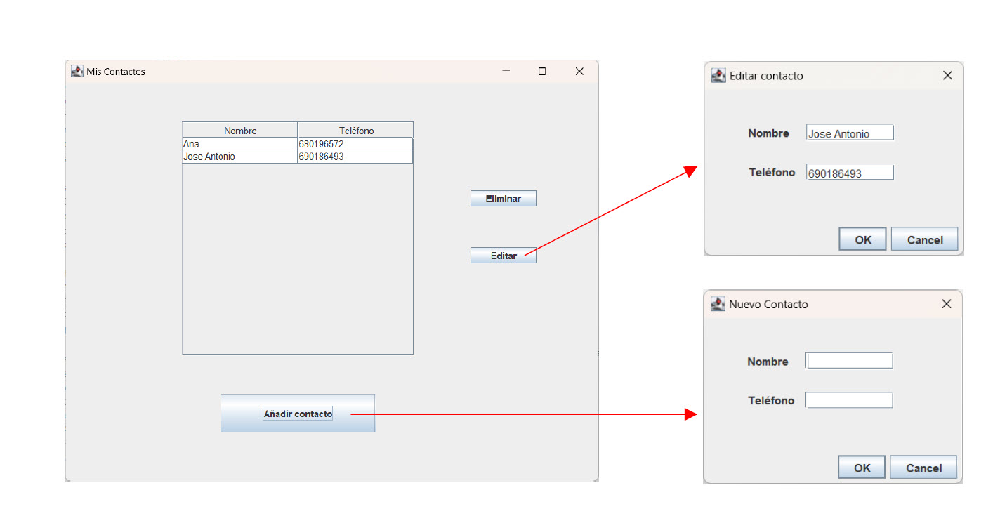
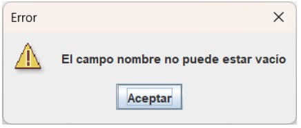
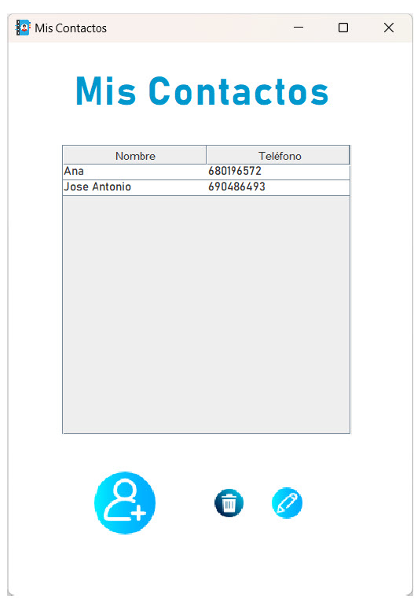

# Actividad 2. Aplicación de gestión de contactos
Fecha de entrega: 30 de noviembre
Porcentaje: 50%
## Requerimiento #1
1. Crea una ventana principal que muestre una lista de contactos en una tabla
de dos columnas y con tres botones para la lógica. La tabla debe disponer
de una barra de desplazamiento por si hay desbordamientos de filas.
(2.5 puntos)
2. Agrega un botón "Añadir contacto" en la ventana principal. Al hacer clic en
el botón "Añadir contacto", se abrirá una nueva ventana emergente que
permitirá al usuario ingresar los detalles del contacto: nombre y número
de teléfono. Después de ingresar los detalles del contacto y hacer clic en
"OK", el contacto se agregará a la lista en la ventana principal. (1.5 puntos)
3. Agrega un botón "Editar". Al hacer clic en este botón, se abrirá otra ventana
emergente que permitirá al usuario editar los detalles del contacto
seleccionado previamente para modificarlos. Al hacer clic en “OK” la tabla
de la ventana principal se actualizará automáticamente con los datos
modificados. (2 puntos)
4. Agrega un botón "Eliminar". Al hacer clic en este botón, se eliminará el
contacto de la lista que se haya seleccionado. (1 punto)
5. [Sugerencia opcional] Agrega la opción de guardar la lista de tareas en un
archivo y cargarla nuevamente en la aplicación.

### Aspectos a tener en cuenta:
 Es fundamental que durante la ejecución de la aplicación no se produzcan
excepciones ni ningún tipo de error. Habrá que gestionarlos y tenerlos en
cuenta desde el código. Probad con la introducción de diferentes tipos de
datos o dejando las cajas vacías. En todo momento habrá que informar al
asuario de las necesidades del programa.
 Para informar al usuario se pueden usar cuadros de diálogos como el
siguiente:

## Requerimiento #2
En esta parte vamos a mejorar la interfaz gráfica de nuestra aplicación, cuyo
aspecto deberás cambiar:
- Color/imagen de fondo. (0.5 puntos)
- Cambiar el aspecto de los botones. (1 punto)
- Cambiar la tipografía que viene por defecto. (0.5 puntos)
- Cambiar el icono de la aplicación y del ejecutable. (0.5 puntos)
- Elementos de diseño extras (sonidos, animaciones, menús, etc). (0.5
puntos)

Se valorará la creatividad. Ejemplo:
